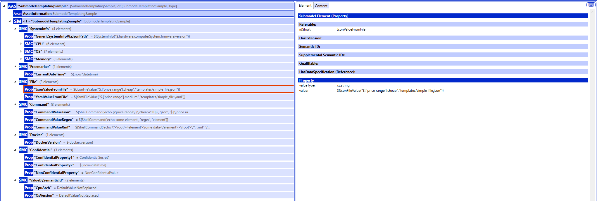

# Resource Self-Description Service

[](https://github.com/eclipse-slm/resource-self-description-service/actions)
[](https://img.shields.io/badge/License-Apache_2.0-blue.svg)

The **Resource Self-Description Service** provides standardized, machine-readable descriptions of devices using the **Asset Administration Shell (AAS)**. It 
enables devices in manufacturing environments to expose self-descriptions of static and dynamic information, supporting interoperability, integration, and 
lifecycle management of heterogeneous system landscapes within manufacturing environments. Data of the device can be accessed using different data sources. 
A data source can provide default submodels, or the data variables of a data source can be used in parametrized submodel templates defined in AASX format.
These parameters inside the submodel template are resolved with the current value from the data source when the submodel gets queried.

## Motivation
Today's manufacturing environments are characterized by a growing number of devices, ranging from traditional industrial controllers to modern edge devices and 
IoT sensors from different vendors. This leads to highly heterogeneous system landscapes in manufacturing environments, posing significant challenges for
managing these system landscapes. While static information about devices (e.g., manufacturer, model, technical specification) is often provided by the
manufacturer, dynamic information (e.g., state values, software versions, configuration parameters) is often difficult to access or not available in a
standardized way. To address this issue, the **Resource Self-Description Service** was developed to provide such information in a standardized way using the 
Asset Administration Shell (AAS).

## Features
- Access device data from various data sources (e.g., files, operating system, system and hardware information, container environments, ...)
- Use default submodels of data sources or define parametrized submodel templates in AASX format depending on your use case
- [Submodel Repository API](https://app.swaggerhub.com/apis/Plattform_i40/SubmodelRepositoryServiceSpecification/V3.0.1_SSP-004) to provide submodels
- Deployment as JAR or Docker container
- Secure access to the API using OAuth2 and OpenID Connect (OIDC) (e.g., Keycloak)
- Encrypt API using TLS

---

## Getting Started

The service can be run as a standalone Java application or as a Docker container. See the examples in the `examples/` directory for the different deployment
options.

## API
The service exposes a REST API based on the [Submodel Repository Service Specification](https://app.swaggerhub.com/apis/Plattform_i40/SubmodelRepositoryServiceSpecification/V3.0.1_SSP-004)
to provide the submodels. By default, the Swagger UI API documentation is available at `http://<device-ip-or-hostname>:48080/swagger-ui.html`.

## Configuration

Configuration is primarily done via the [application.yml](app/src/main/resources/application.yml). As Spring Boot is used as a framework, all values in
[application.yml](app/src/main/resources/application.yml) can also be set via environment variables (see [Spring Boot Docs: Externalized Configuration Using 
Environment Variables](https://docs.spring.io/spring-boot/reference/features/external-config.html#features.external-config.files.env-variables). The following 
table provides an overview of the most important configuration options as environment variables:

| Environment Variable       | Description                                                                                                                                                                                                                                                                       | Required | Default Value                                 |
|----------------------------|-----------------------------------------------------------------------------------------------------------------------------------------------------------------------------------------------------------------------------------------------------------------------------------|----------|-----------------------------------------------|
| `RESOURCE_ID`              | Id of the resource for which the submodels are provided                                                                                                                                                                                                                           | Yes      | 00000000-0000-0000-0000-000000000000          |
| `RESOURCE_AAS_PREFIX`      | Prefix for the AAS id of the resource AAS                                                                                                                                                                                                                                         | No       | Resource                                      |
| `RESOURCE_AAS_ID`          | Id of the resource AAS. By default it is created using the `RESOURCE_AAS_PREFIX` and the `RESOURCE_ID`                                                                                                                                                                            | No       | Resource_00000000-0000-0000-0000-000000000000 |
| `DEPLOYMENT_SCHEME`        | The HTTP scheme with which the service can be accessed.                                                                                                                                                                                                                           | No       | http                                          |
| `DEPLOYMENT_HOST`          | The host (IP or hostname) on which the service can be accessed.                                                                                                                                                                                                                   | No       | localhost                                     |
| `DEPLOYMENT_PORT`          | The port on which the service can be accessed.                                                                                                                                                                                                                                    | No       | 48080                                         |
| `DEPLOYMENT_PATH`          | The base path under which the service can be accessed.                                                                                                                                                                                                                            | No       | /                                             |
| `DEPLOYMENT_URL`           | The full URL (scheme, host, port, path) under which the service can be accessed. By default it is created using `DEPLOYMENT_SCHEME`, `DEPLOYMENT_HOSTNAME`, `DEPLOYMENT_PORT` and `DEPLOYMENT_PATH`. The value is used as endpoint for the registration at the Submodel Registry. | No       | http://localhost:48080/                       |
| `SECURITY_ENABLED`         | Whether security is enabled or not. If enabled, OAuth2 / OpenID Connect (OIDC) is used for authentication and authorization as well as TLS to encrypt API access.                                                                                                                 | No       | false                                         |
| `SECURITY_ORIGINS`         | Comma-separated list of allowed CORS origins. Only used if `SECURITY_ENABLED` is set to `true`.                                                                                                                                                                                   | No       | *                                             |
| `SECURITY_CERTIFICATE`     | Path to the TLS certificate file (in PEM format). Only used if `SECURITY_ENABLED` is set to `true`.                                                                                                                                                                               | No       | classpath:./certs/resource.crt                |
| `SECURITY_PRIVATE_KEY`     | Path to the TLS private key file (in PEM format). Only used if `SECURITY_ENABLED` is set to `true`.                                                                                                                                                                               | No       | classpath:./certs/resource.key                |
| `JWT_AUTH_ISSUER_URI`      | The issuer URI of the OpenID Connect (OIDC) provider (e.g., Keycloak). Only used if `SECURITY_ENABLED` is set to `true`.                                                                                                                                                          | No       | issuer-uri: https://localhost/auth/realms/slm |
| `SERVER_PORT`              | The port on which the service listens for incoming requests.                                                                                                                                                                                                                      | No       | 48080                                         |
| `AAS_AASREGISTRY_URL`      | The URL of the Shell Registry to lookup the resource AAS. The AAS must exist, it is not created automatically. If the AAS is missing, application startup will fail.                                                                                                              | Yes      | http://localhost:8082                         |
| `AAS_SUBMODELREGISTRY_URL` | The URL of the Submodel Registry where the submodels are registered. For the registration the `DEPLOYMENT_URL` is used for the endpoint definition in the submodel descriptor.                                                                                                    | Yes      | http://localhost:8083                         |
| `DATASOURCES_...`          | Depending on the data source, different configuration options are available. See the documentation for the specific data source for the available configuration options.                                                                                                          | No       | -                                             |

## Data Sources

The service supports different data sources to access the device data. Currently the following data sources are available:

- **Template**: AASX submodel templates with parameters that are resolved using template variables or values from other data sources.
- **SystemInfo**: Provides system and hardware information (e.g., CPU, memory, disk, network, operating system, ...) using the [OSHI](https://github.com/oshi/oshi) library.
- **Docker**: Provides information about the Docker environment (e.g., Docker version, containers, images, volumes, networks, ...) using the Docker host.

All data sources have the following common configuration options:

| Environment Variable          | Description                                                                                         | Required | Default Value  |
|-------------------------------|-----------------------------------------------------------------------------------------------------|----------|----------------|
| `DATASOURCES_<NAME>_ENABLED`  | Whether the data source is enabled or not.                                                          | No       | true           |
| `DATASOURCES_<NAME>_PROVIDEDSUBMODELS` | Whether the data source provides its default submodel or not.                              | No       | true           |
| `DATASOURCES_<NAME>_VALUEBYSEMANTICID` | Whether the data source provides values for specific ids or not. | No                      | -        | true           |

### Template
The Template data source allows to define submodel templates in AASX format with parameters that are resolved using template variables or values from 
template methods or other data sources. To create or edit the AASX files the [Eclipse AASX Package Explorer](https://github.com/eclipse-aaspe/package-explorer))
is recommended. The AASX files must be placed in the `templates/` directory next to the JAR. Depending on the deployment, this can be done in different ways. 
The [examples](examples/) directory contains examples for the various deployment options. The parameters must be directly defined as value of a property in the
submodel template. The image below shows an example of a submodel displayed in the Eclipse AASX Package Explorer.



As template engine [Apache FreeMarker](https://freemarker.apache.org/index.html) is used. The following methods and variables can be used to parameterize the 
submodel templates:

* **FreeMarker built-in methods and variables** (see [FreeMarker Docs: Built-ins](https://freemarker.apache.org/docs/ref_builtins.html))
* **Additional methods provided by the self-description service**
  * JsonFileValue: Read value from JSON file using JSONPath expression
    * Method syntax: 
      ```
      ${JsonFileValue("<JSONPath expression>","<path to JSON file>")}`
      ```
    * Example:
      ```
      ${JsonFileValue("$.['price range'].cheap","templates/simple_file.json")}
      ```
  * YamlFileValue: Read value from YAML file using JSONPath expression
    * Method syntax:
      ```
      ${YamlFileValue("<JSONPath expression>","<path to YAML file>")}`
      ```
    * Example:
      ```
      ${YamlFileValue("$.['price range'].medium","templates/simple_file.yaml")}
      ```
  * ShellCommand: Execute shell command and evaluate output using one of the supported output types.
    * Supported output types: `json`, `xml`, `regex`
    * Method syntax:
      ```
      ${ShellCommand("<command>", "<output type (must be one of the supported output types>", "<evaluation expression for output (e.g. JSONPath, XPath, regaular expression)>")}`
      ```
      where
      ```
    * Example with command returning JSON output:
      ```
      ${ShellCommand('echo {\'price range\':{\'cheap\':10}}', 'json', '$.[\'price range\'].cheap')}
      ```
    * Example with command returning XML output:
      ```
      ${ShellCommand('echo \"<root><element>Some data</element></root>\"', 'xml', '/root/element')}
      ```
    * Example with command returning plain text output evaluated using a regular expression:
      ```
      ${ShellCommand('echo some element', 'regex', 'element')}
      ```
* **Data values from data sources**: The data sources can provide values by defined variables (e.g., `cpu.arch` or `os.version`). These variables be used with
  the Apache FreeMarker syntax (e.g, `${cpu.arch}` or `${os.version}`) to resolve the parameter with the current value from the data source. The image below 
  shows how it is used, using the SystemInfo data source as an example.

  

In addition to the methods and variables described above, data sources define semantic IDs for which they can provide values. If a semantic ID is defined for 
property for which an activated data source can provide a value, the property value is automatically retrieved from the data source and inserted if the 
configuration parameter `DATASOURCES_<NAME>_VALUEBYSEMANTICID` is set to `true` for the data source. The semantic IDs for which values can be provided can be 
found in the individual data source documentations below.

The datasource provides the following additional configuration options:

| Environment Variable                            | Description                                                                                                                                          | Required | Default Value |
|-------------------------------------------------|------------------------------------------------------------------------------------------------------------------------------------------------------|----------|---------------|
| `DATASOURCES_TEMPLATES_CONFIDENTIALSEMANTICIDS` | Comma-separated list of semantic ids for which the values are considered confidential and are therefore not rendered when the submodel gets queried. | No       |               |

### SystemInfo
Provides system and hardware information (e.g., CPU, memory, disk, network, operating system, ...) using the [OPERATING SYSTEM & HARDWARE INFORMATION (OSHI) library](https://github.com/oshi/oshi).
It provides the following additional configuration options:

| Environment Variable                                       | Description                                                                                                 | Required | Default Value |
|------------------------------------------------------------|-------------------------------------------------------------------------------------------------------------|----------|---------------|
| `DATASOURCES_SYSTEMINFO_CACHING_OVERALL_ENABLED`           | Whether overall caching is enabled or not. If enabled, the overall system information is cached.            | No       | false         |
| `DATASOURCES_SYSTEMINFO_CACHING_OVERALL_REFRESHINTERVALLS` | The refresh intervall in seconds for the overall caching.                                                   | No       | 300           |
| `DATASOURCES_SYSTEMINFO_CACHING_CPU_ENABLED`               | Whether CPU caching is enabled or not. If enabled, the CPU information is cached.                           | No       | false         |  
| `DATASOURCES_SYSTEMINFO_CACHING_CPU_REFRESHINTERVALLS`     | The refresh intervall in seconds for the CPU caching.                                                       | No       | 60            |
| `DATASOURCES_SYSTEMINFO_CACHING_MEMORY_ENABLED`            | Whether memory caching is enabled or not. If enabled, the memory information is cached.                     | No       | false         |  
| `DATASOURCES_SYSTEMINFO_CACHING_MEMORY_REFRESHINTERVALLS`  | The refresh intervall in seconds for the memory caching.                                                    | No       | 60            |
| `DATASOURCES_SYSTEMINFO_CACHING_OS_ENABLED`                | Whether operating system caching is enabled or not. If enabled, the operating system information is cached. | No       | false         |
| `DATASOURCES_SYSTEMINFO_CACHING_OS_REFRESHINTERVALLS`      | The refresh intervall in seconds for the operating system caching.                                          | No       | 300           |

It provides the following data source value definitions which can be used for template definition:

| Value Name           | Description                                        | Semantic ID                                         |
|----------------------|----------------------------------------------------|-----------------------------------------------------|
| `cpu.architecture`   | The architecture of the CPU (e.g., x86_64, arm64). | http://eclipse.dev/slm/aas/sme/SysteInfo/CPU/Arch   |
| `cpu.name`           | The name of the CPU.                               | -                                                   |
| `cpu.vendor`         | The vendor of the CPU.                             | -                                                   |
| `cpu.logical_cores`  | Number of logical CPU cores.                       | -                                                   |
| `cpu.physical_cores` | Number of physical CPU cores.                      | -                                                   |
| `cpu.max_frequency`  | Maximum CPU frequency in Hz.                       | -                                                   |
| `mem.free_memory`    | Free memory in bytes.                              | -                                                   |
| `mem.used_memory`    | Used memory in bytes.                              | -                                                   |
| `mem.total_memory`   | Total memory in bytes.                             | -                                                   |
| `os.version`         | Operating system version.                          | http://eclipse.dev/slm/aas/sme/SysteInfo/OS/Version |
| `os.build_number`    | Operating system build number.                     | -                                                   |
| `os.bitness`         | Operating system bitness (e.g., 64, 32).           | -                                                   |
| `os.boottime`        | System boot time (timestamp).                      | -                                                   |
| `os.family`          | Operating system family.                           | -                                                   |
| `os.uptime_seconds`  | System uptime in seconds.                          | -                                                   |
| `os.manufacturer`    | Operating system manufacturer.                     | -                                                   |

In addition, the data source provides a FreeMarker method for accessing all information provided by [OSHI]((https://github.com/oshi/oshi)). The information 
provided by OSHI is parsed as JSON and can be read using a JSONPath expression. Depending on the system, querying all operating system and hardware information 
can take a long time. The information is therefore cached, which can be configured using the `DATASOURCES_SYSTEMINFO_CACHING_OVERALL_REFRESHINTERVALLS` 
configuration parameter described above. 

Example:
```
${SystemInfo("$.hardware.computerSystem.firmware.version")}
```

### Docker
Provides information about the Docker environment (e.g., Docker version, containers, images, volumes, networks, ...). To gather the data the Docker host must be
accessible. It provides the following additional configuration options:

| Environment Variable                  | Description                                                                                         | Required | Default Value        |
|---------------------------------------|-----------------------------------------------------------------------------------------------------|----------|----------------------|
| `DATASOURCES_DOCKER_DOCKERHOST`       | The URL of the Docker host (e.g., `unix:///var/run/docker.sock` or `tcp://localhost:2375`).         | Yes      | tcp://localhost:2375 |

It provides the following data source value definitions which can be used for template definition:

| Value Name               | Description                                                                                         | Semantic ID  |
|--------------------------|-----------------------------------------------------------------------------------------------------|--------------|
| `DockerVersion`          | The version of the Docker engine.                                                                   | -            |
