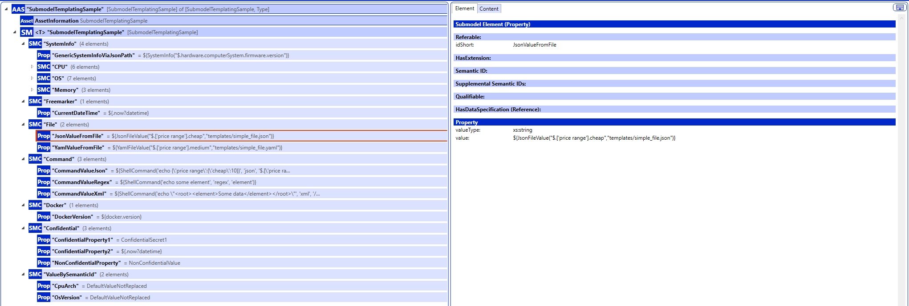
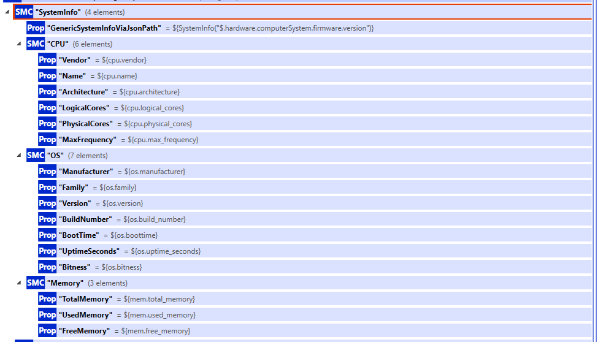

# Data Source | Template

The Template data source allows to define submodel templates in AASX format with parameters that are resolved using template variables or values from
template methods or other data sources. To create or edit the AASX files the [Eclipse AASX Package Explorer](https://github.com/eclipse-aaspe/package-explorer))
is recommended. The AASX files must be placed in the `templates/` directory next to the JAR. Depending on the deployment, this can be done in different ways.
The [examples](examples) directory contains examples for the various deployment options. The parameters must be directly defined as value of a property in the
submodel template. The image below shows an example of a submodel displayed in the Eclipse AASX Package Explorer.



As template engine [Apache FreeMarker](https://freemarker.apache.org/index.html) is used. The following methods and variables can be used to parameterize the
submodel templates:

* **FreeMarker built-in methods and variables** (see [FreeMarker Docs: Built-ins](https://freemarker.apache.org/docs/ref_builtins.html))
* **Additional methods provided by the self-description service**
    * JsonFileValue: Read value from JSON file using JSONPath expression
        * Method syntax:
          ```
          ${JsonFileValue("<JSONPath expression>","<path to JSON file>")}`
          ```
        * Example:
          ```
          ${JsonFileValue("$.['price range'].cheap","templates/simple_file.json")}
          ```
    * YamlFileValue: Read value from YAML file using JSONPath expression
        * Method syntax:
          ```
          ${YamlFileValue("<JSONPath expression>","<path to YAML file>")}`
          ```
        * Example:
          ```
          ${YamlFileValue("$.['price range'].medium","templates/simple_file.yaml")}
          ```
    * ShellCommand: Execute shell command and evaluate output using one of the supported output types.
        * Supported output types: `json`, `xml`, `regex`
        * Method syntax:
          ```
          ${ShellCommand("<command>", "<output type (must be one of the supported output types>", "<evaluation expression for output (e.g. JSONPath, XPath, regaular expression)>")}`
          ```
          where
          ```
        * Example with command returning JSON output:
          ```
          ${ShellCommand('echo {\'price range\':{\'cheap\':10}}', 'json', '$.[\'price range\'].cheap')}
          ```
        * Example with command returning XML output:
          ```
          ${ShellCommand('echo \"<root><element>Some data</element></root>\"', 'xml', '/root/element')}
          ```
        * Example with command returning plain text output evaluated using a regular expression:
          ```
          ${ShellCommand('echo some element', 'regex', 'element')}
          ```
* **Data values from data sources**: The data sources can provide values by defined variables (e.g., `cpu.arch` or `os.version`). These variables be used with
  the Apache FreeMarker syntax (e.g, `${cpu.arch}` or `${os.version}`) to resolve the parameter with the current value from the data source. The image below
  shows how it is used, using the SystemInfo data source as an example.

  

In addition to the methods and variables described above, data sources define semantic IDs for which they can provide values. If a semantic ID is defined for
property for which an activated data source can provide a value, the property value is automatically retrieved from the data source and inserted if the
configuration parameter `DATASOURCES_<NAME>_VALUEBYSEMANTICID` is set to `true` for the data source. The semantic IDs for which values can be provided can be
found in the individual data source documentations below.

The datasource provides the following additional configuration options:

| Environment Variable                            | Description                                                                                                                                          | Required | Default Value |
|-------------------------------------------------|------------------------------------------------------------------------------------------------------------------------------------------------------|----------|---------------|
| `DATASOURCES_TEMPLATES_CONFIDENTIALSEMANTICIDS` | Comma-separated list of semantic ids for which the values are considered confidential and are therefore not rendered when the submodel gets queried. | No       |               |


